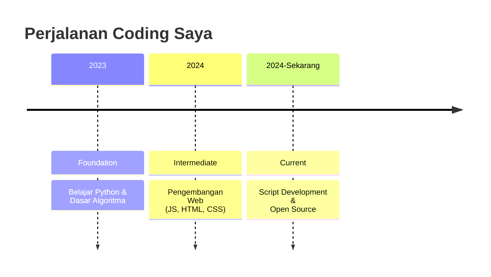

<!-- Header dengan animasi -->
<div align="center">
  
  
  
  # 🦅 Elang Muhammad Ridzqy Jamaludin
  
  ### `@Elang-elang` | Software Developer & Script Creator
  
  
  
  

</div>

---

## ✨ Tentang Saya

```javascript
const developer = {
  name: "Elang Muhammad Ridzqy Jamaludin",
  username: "Elang-elang",
  role: "Full-Stack Developer & Script Creator",
  mission: "Membangun proyek yang bermanfaat bagi banyak orang",
  status: "🚀 Sedang merintis perjalanan developer",
  philosophy: "Kode yang baik adalah kode yang digunakan dan bermanfaat"
};
```

"Sebagai pemula yang sedang bertumbuh, saya berkomitmen untuk menciptakan solusi digital yang dapat membantu kehidupan sehari-hari. Setiap baris kode adalah langkah menuju impian."

---

## 🛠️ Keahlian Teknis

### Bahasa Pemrograman

<div align="center" style="max-width: 100%; overflow-x: auto;">

Python JavaScript C C++ Java
<br/>
    
<br />
**Logos**
</div>

### Teknologi & Tools

<p align="center">
  
  
  
  
  
</p>

---

## Statistik

<div align="center">

  <br/>

  
  
  
  
</div>

---

## 🚀 Proyek Unggulan

### 🔥 Script Automation Suite

Koleksi script Python untuk otomatisasi database (Data)

```
├── JsonDB[Python|Node]/     # Library QUERY untuk JSON
├── PyDB-Encrypted/          # Library QUERY terenkripsi untuk JSON
└── Data-Toolkit/            # Toolkit manipulasi data otomatis
```

```python
# Contoh: PyDB-Encrypted
from pydb_encrypted import EncryptedDB

db = EncryptedDB("my_database", password="secure123")
db.insert({"name": "Elang", "project": "JsonDB"})
data = db.query("name", "Elang")
print(f"Data ditemukan: {data}")
```

---

### 📈 Perjalanan Coding Saya

Penjelasan:

Tahap Periode Durasi Pencapaian
Intermediate 2023-11 s/d 2024-03 4 bulan Pengembangan Web (JS, HTML, CSS)
Foundation 2024-06 s/d 2024-11 5 bulan Belajar Python & Dasar Algoritma
Current 2024 s/d Sekarang Sedang berjalan Script Development & Open Source

Diagram:



---

### 🎯 Visi & Misi

<div align="center">

  

</div>

Visi

Menjadi developer yang kontribusinya bermanfaat bagi komunitas open source

Misi 2024-2025

· Membuat 5+ script open source
· Kontribusi ke 2+ proyek open source
· Membangun komunitas developer pemula
· Mencapai 1000+ pengguna proyek saya

Progress saat ini: 🟢 2/5 script | 🟡 1/2 kontribusi

---

### 📫 Hubungi Saya

<p align="center">
  <a href="mailto:elangmuhammad888@gmail.com">
    
  </a>
  <a href="https://tiktok.com/@calangit_preset">
    
  </a>
</p>

<div align="center">
  <i>💬 Jangan ragu untuk menghubungi saya untuk kolaborasi atau diskusi!</i>
</div>

---

### 💡 Quote Harian

"The sky is not the limit for an eagle, and neither is code for a developer." - Elang-elang

<div align="center">

  

---

Terima kasih telah mengunjungi profil saya!

### ⭐ Jangan lupa untuk star repositori favorit Anda!

  <br/>

  

</div>